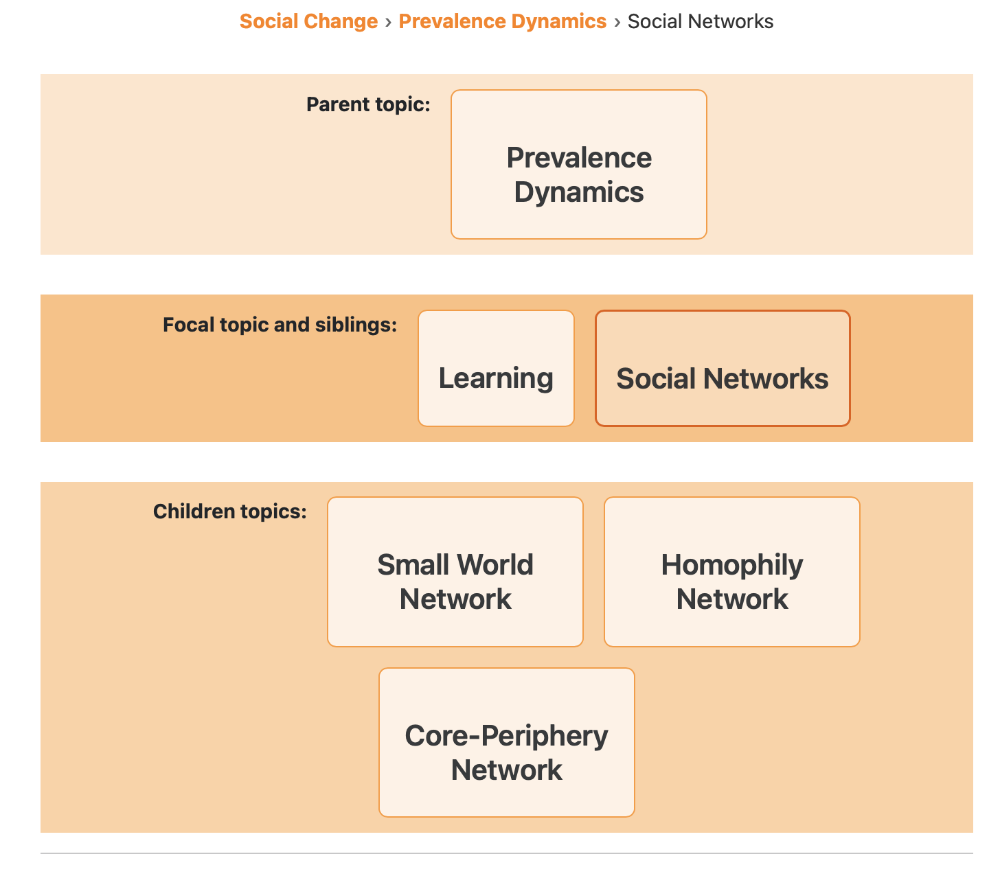

# "Crossreference Cards" Extension For Quarto

This extension adds a `crossref-cards` shortcode to Quarto for displaying 
searchable, filterable reference cards the user provides in structured yaml files 
(extension `.yml`).  

I made it to build a compendium of cross-referenced information to understand theoretical connections and differences between different social science disciplines for my research and teaching in *Social Science for Sustainability*.  

## Use

Just place the following shortcode command where you want the table:

```{shortcodes=false}

``` 

If you change the name of the topics yaml file you'll need to update the [_quarto.yml](https://github.com/mt-digital/quarto-crossref-cards/quarto.yml) 
as well that goes with `examples.qmd`. Here is the current one where the example uses the default theme (`format` options all commented out).

```yaml
project:
  type: website
  resources: 
    - social-science-topics.yml  # <-- CHANGE THIS IF YOU CHANGE THE .yml FILE NAME
#format:
#  html:
    # css: neon.css
    # css: forest.css
#    css: blue.css
    # css: orange.css
```

To use the neon theme, change `_quarto.yml` like so:

```yaml
project:
  type: website
  resources: 
    - social-science-topics.yml  # <-- CHANGE THIS IF YOU CHANGE THE .yml FILE NAME

format:
  html:
    css: neon.css
    # css: forest.css
    # css: blue.css
    # css: orange.css
```

See the examples below for how this looks with different themes. 

## Themes

The default theme is meant to match [Social Science for Sustainability](https://SocSci-for-Sustainability.github.io) branding. I included additional .css files in the [root directory of the extension repository](https://github.com/mt-digital/quarto-crossref-cards/) that can be freely downloaded and used. 

### Default


### Neon


### Forest


### Blue


### Orange


